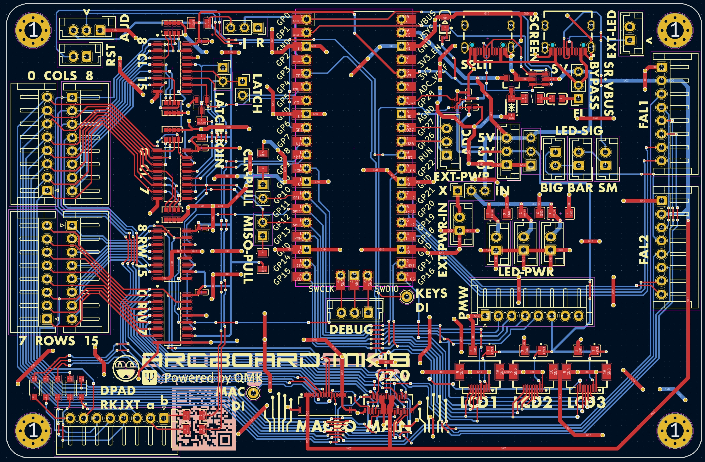

# mk19-pcb
The antithesis of 'keep it simple, stupid' - all the features, all the time.

Do you need...
- To use the [Cyboard flex-pcb system](https://www.cyboard.digital/product-page/dactyl-flex-pcbs)?  [and extend it?](https://github.com/christrotter/macropad-pcb)?
- Two [Ultrafalcons](https://github.com/christrotter/ultrafalcon) (_PER60 encoder, GC9A01 TFT button, 30 leds_)...per side?
- SPI devices
  - PMW3360/3389 w. 34mm ball on roller-bearings (_right side only_)
  - Dual GC9A01 TFTs per side, integrated into 
  - Quad-shift register-powered 32 pins for rows/cols? ([available as a dedicated breakout here](https://github.com/christrotter/shift-register-spi-breakout-pcb))
- [5-way switch](https://github.com/christrotter/5way-pcb) or [RKJXT](https://github.com/christrotter/rkjxt-mini-breakout) for arrow keys?
- Perhaps enough RGB to illumine your entire home? (_and almost certainly require 5v supplementary power - a feature, not a bug!_)  
- Audio and ADC breakouts?  Reset switch? Power and debug breakouts?
- And use an existing RP Pico to do it?

Probably not, which is why I had to design my own pcb.  So here it is...

# the community that built it
- burkfers (research assistant extraordinaire)
- bomtarnes, chefcooke, walrus, wimads, yingeling, genki, others for design/3d printing help
- Quentin @ BKB
- the BKB discord crew
- casuanoob (Falcon and diy pcb inspiration)
- tzarc, freznel, KarlK90, Dr. Faustroll, GeorgeN, (and others!) work on shift registers, pcbs, etc
- Erik @ Cyboard
- QMK discord
- fingerpunch discord (Sadek and Melon, thanks!)
- cardiactuna for the font suggestion
- definitely more I'm forgetting

# design goals
- Provide a re-usable platform for the arcboards that includes all of the normal functions
- Make it possible to use the Cyboard flex-pcb system to save on the madness of per-key pcb soldering
- Minimize GPIO usage by moving cols/rows over to shift registers
- Reduce the amount of fiddly soldering and wire stripping a normal hand-wire requires of you
- usb-c interconnects
- General improvements on the mk17.

## feature details
- Raspberry PI Pico (RP2040) footprint - just add pin headers and solder away - or, solder right to pads
- keys provided through the Cyboard flex-pcb: https://www.cyboard.digital/product-page/dactyl-flex-pcbs
 - or, JST-XH 2.54 headers
- macropad using Cyboard flex-pcb keys, custom breakout pcb: https://github.com/christrotter/macropad-pcb (0.5mm pitch 16-pin FFC cable)
 - vertical FFC connector
- dpad using custom breakout pcb: https://github.com/christrotter/5way-pcb
 - diodes are configured for ROW2COL
- usb-c split connector w. tzarc-grade voltage protection
 - buuut included a solder pad jumper to bypass if needed
- split-handedness pin
- SPI breakouts
  - PMW33xx
  - LCD (e.g. GC9A01)
  - shift registers (595 for rows, 589 for cols)
- pin breakouts
 - power, debug, ADC, audio, reset
 - remaining GPIO pins
 - test points (SPI pins, serial pins, WS2818 before/after level shifting)
- led breakouts w. bypasses
 - keys
 - 2x falcon pcbs
 - indicator strip
 - screen-mounted external indicators via usb-c
 - pin for whatever else you want to add to the chain

## pcb features

- two-layer pcb w. dual ground planes tied w. vias
- components configured as per datasheets
- bypass capacitors!
- care taken to avoid power running alongside signal for too long

# schematic overview
## mcu

## keys

## peripherals

## usb connections

## breakouts

